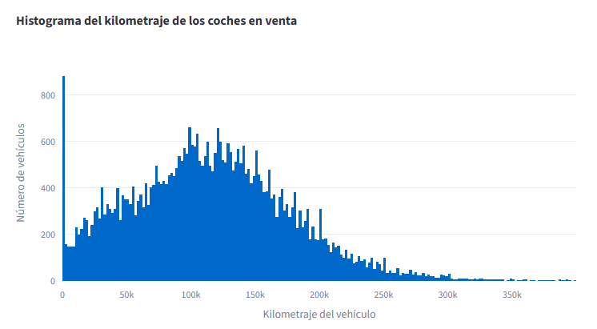

# Proyecto Sprint 7
# Analizador de Datos de Vehículos

Este proyecto es una aplicación web interactiva desarrollada con **Streamlit**. Su objetivo es proporcionar herramientas de análisis visual para un conjunto de datos de anuncios de venta de vehículos en los Estados Unidos.

## Funcionalidad
La aplicación permite a los usuarios explorar los datos mediante visualizaciones dinámicas:
* **Histogramas**: Ideales para visualizar la distribución de variables como el kilometraje.
* **Gráficos de Dispersión (Scatter)**: Útiles para analizar la relación entre dos variables numéricas, como el precio frente al kilometraje.
* **Interactividad**: Gracias a **Plotly**, los usuarios pueden interactuar con los gráficos, hacer zoom y ver detalles al pasar el cursor.

## Tecnologías utilizadas
* **Python**: Lenguaje principal de desarrollo.
* **Pandas**: Para la manipulación y limpieza de los datos del archivo `vehicles_us.csv`.
* **Streamlit**: Framework utilizado para construir la interfaz web.
* **Plotly Express**: Para la creación de gráficos interactivos y modernos.

## Cómo ejecutar la aplicación
1. Clona este repositorio.
2. Asegúrate de tener instalado Python y las librerías necesarias (`pip install -r requirements.txt`).
3. Ejecuta el comando: `streamlit run app.py` en tu terminal.

---
## Autor
**Joel Arjona** 